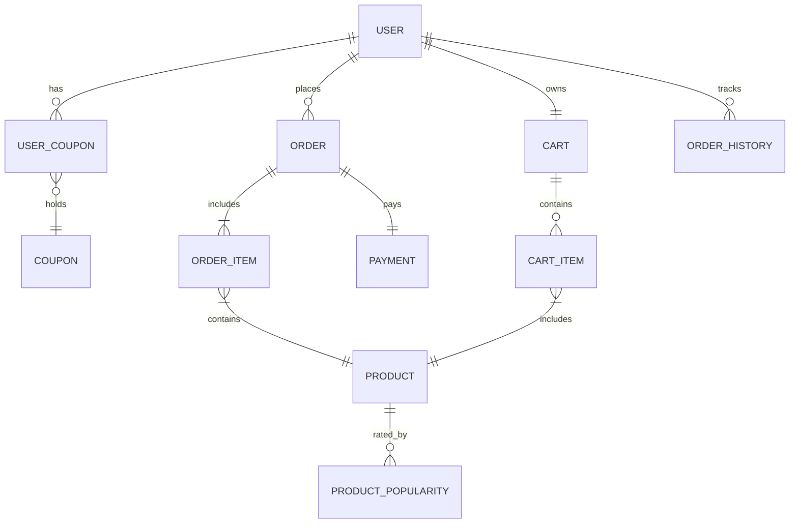

# ERD



````mermaid
erDiagram
    USER {
        string userId         "사용자 고유 ID"
        string userName       "사용자 이름"
        string phone          "연락처"
        string email          "이메일 주소"
        ENUM useState         "활성/비활성 상태 (예: ACTIVE/INACTIVE)"
        ENUM hasCoupon        "쿠폰 보유 여부 (예: YES/NO)"
        date registDate       "가입 일자"
        date modiDate         "수정 일자"
        date deleteDate       "삭제 처리 일자 (회원 탈퇴)"
    }

    COUPON {
        string coupId         "쿠폰 고유 ID"
        string coupName       "쿠폰 이름"
        string coupDesc       "쿠폰 설명"
        int discountAmount    "할인 금액"
        int totalCount        "전체 발급 수량"
        date registDate       "등록 일자"
        date startDate        "사용 시작일"
        date endDate          "사용 종료일"
    }

    USER_COUPON {
        string userId         "사용자 ID (복합 PK)"
        string coupId         "쿠폰 ID (복합 PK)"
        ENUM isUsed           "사용 여부 (예: USED/UNUSED)"
    }

    ORDER {
        string orderId        "주문 고유 ID"
        string userId         "주문자 ID (FK)"
        date orderDate        "주문 일자"
        ENUM orderStatus      "주문 상태 (COMPLETED, CANCELLED, DELIVERING)"
        int totalAmount       "총 주문 금액"
    }

    ORDER_ITEM {
        string orderItemId    "주문 항목 고유 ID"
        string orderId        "주문 ID (FK)"
        string productCode    "상품 코드"
        int quantity          "주문 수량"
        int priceAtOrder      "주문 시 가격"
    }

    PAYMENT {
        string paymentId      "결제 고유 ID"
        string orderId        "주문 ID (FK)"
        ENUM paymentMethod    "결제 방식 (CARD, BANK, PAY)"
        ENUM paymentStatus    "결제 상태 (PAID, FAILED, REFUNDED)"
        date paidAt           "결제 완료 시간"
        int paidAmount        "실제 결제 금액"
    }

    PRODUCT {
        string productCode    "상품 고유 코드"
        string productName    "상품명"
        string productInfo    "상품 상세 설명"
        int price             "정가"
        int amount            "재고 수량"
    }

    CART {
        string cartId         "장바구니 고유 ID"
        string userId         "사용자 ID (FK)"
        date addAt            "장바구니 생성 시각"
    }

    CART_ITEM {
        string cartItemId     "장바구니 항목 고유 ID"
        string cartId         "장바구니 ID (FK)"
        string productCode    "상품 코드"
        int quantity          "장바구니에 담긴 수량"
    }

    ORDER_HISTORY {
        string historyId      "이력 고유 ID"
        string userId         "사용자 ID"
        string orderId        "주문 ID"
        string status         "상태 내용 (예: 주문 완료 → 배송 중)"
        date changedAt        "변경 시각"
    }

    PRODUCT_POPULARITY {
        string productCode    "상품 코드"
        int viewCount         "조회 수"
        int purchaseCount     "구매 수"
        date lastUpdated      "최종 집계 시간"
    }


````
