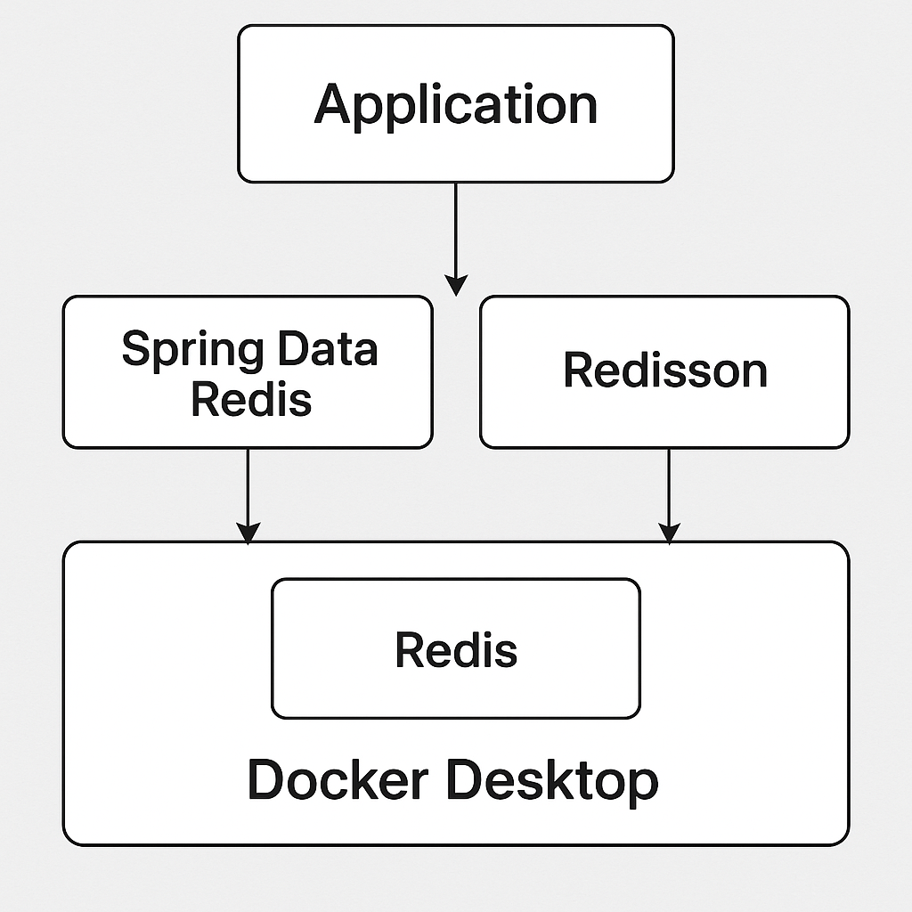

# Spring Data Redis & Redisson 정리



## 1. Spring Data Redis
- **Spring 공식 프로젝트**
- Redis를 Key-Value 저장소로 사용하고, Spring의 데이터 액세스 추상화와 통합
- **주요 기능**
  - `RedisTemplate`, `StringRedisTemplate` 제공
  - `@Cacheable`, `@CacheEvict` 등의 캐시 어노테이션 지원
  - Pub/Sub, 키/값 조작, Hash/List/Set 자료구조 지원
  - 직렬화 커스터마이징 가능 (Jackson, JDK 직렬화 등)
- **기본 클라이언트**: Lettuce (비동기 지원)

**예시 코드**
```java
@Autowired
private StringRedisTemplate redisTemplate;

redisTemplate.opsForValue().set("user:1", "홍길동");
String name = redisTemplate.opsForValue().get("user:1");
```

---

## 2. Redisson
- **서드파티 라이브러리** (Spring 공식 아님)
- Redis를 단순 Key-Value 저장소 이상의 **분산 데이터 구조/동시성 제어** 기능으로 확장
- **주요 기능**
  - 분산락 (`RLock`), 세마포어, CountDownLatch, RateLimiter
  - Redis 기반의 Java 컬렉션 API (`RMap`, `RList`, `RSet` 등)
  - 큐, 토픽, Pub/Sub, 원격 서비스 호출 지원
- **클러스터/센티넬/마스터-슬레이브** 구조 지원

**예시 코드**
```java
RLock lock = redissonClient.getLock("lock:order:123");
if (lock.tryLock()) {
    try {
        // 임계 구역 처리
    } finally {
        lock.unlock();
    }
}
```

---

## 3. 비교

| 항목 | Spring Data Redis | Redisson |
|------|------------------|----------|
| 소속 | Spring 공식 | 서드파티(OSS) |
| 주 용도 | 캐시, Key-Value 저장, Pub/Sub | 분산락, 동시성 제어, Java 객체 컬렉션 |
| 클라이언트 | Lettuce/Jedis | 자체 클라이언트 |
| 장점 | 스프링 생태계와 밀착, 단순 데이터 작업에 최적 | 고급 동시성 기능, Java 컬렉션 API와 유사 |
| 단점 | 동시성 제어, 락 기능은 직접 구현 필요 | 단순 CRUD만 하면 과한 선택일 수 있음 |

---

## 4. 함께 쓰는 경우
- **Spring Data Redis** → 데이터 조회/저장, 캐시
- **Redisson** → 분산락, 동시성 제어, 고급 자료구조
- 하나의 Redis 서버를 공유하면서 각기 다른 목적에 맞게 사용 가능

**구조**
```
Application
 ├── Spring Data Redis  → Redis (캐시, 데이터)
 └── Redisson           → Redis (분산락, 동시성 제어)
```
