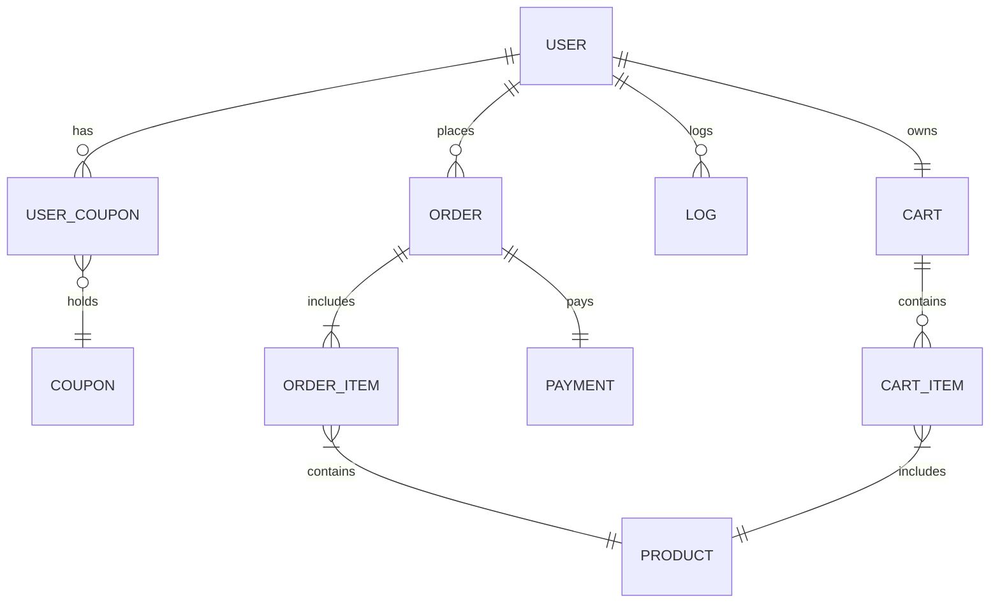

# ERD



````mermaid
erDiagram
    USER {
        string userId
        string userName
        string phone
        string email
        ENUM useState
        ENUM hasCoupon
        date registDate
        date modiDate
        date deleteDate
    }

    COUPON {
        string coupId
        string coupName
        string coupDesc
        int discountAmount
        int totalCount
        date registDate
        date startDate
        date endDate
    }

    UserCoupon {
        string userId
        string coupId
        ENUM isUsed
    }

    PRODUCT {
        string productCode
        string productName
        String productInfo
        int price
        int amount
    }

    ORDER {
        int orderId
        string userId
        string productCode
        int saleCount
    }

    ORDER_ITEM {
        string orderItemId
        string orderId
        string productCode
        string quantity
        string priceAtOrder
    }

    CART {
        string cartId
        string userId
        date addAt
    }

    CART_ITEM {
        string cartItemId
        string cartId
        string productCode
        int quantity
    }


    LOG {
        string userId
        string productCode
        int saleCount
        string priceAtOrder
        date createDate
    }
````
