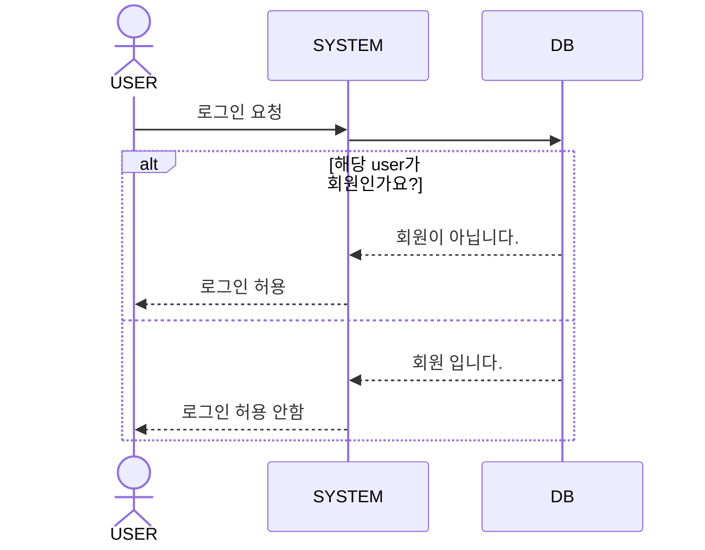
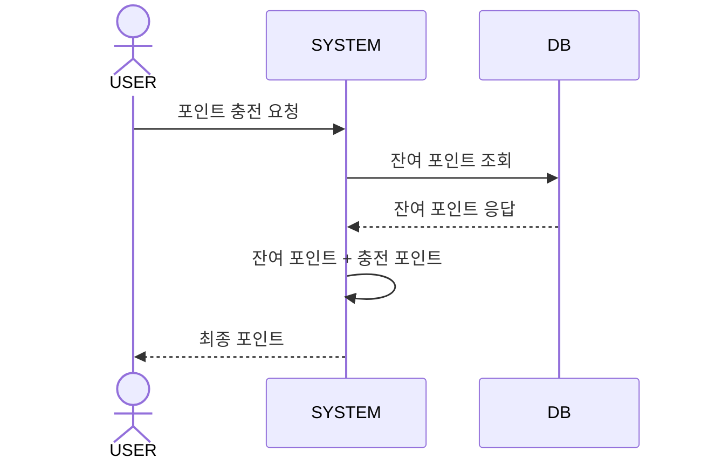
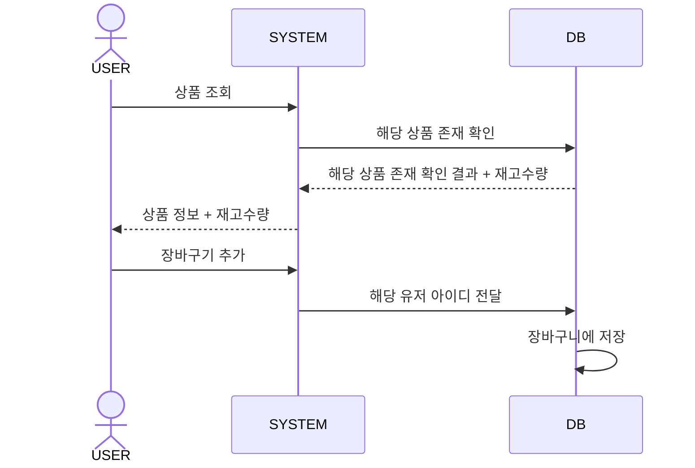
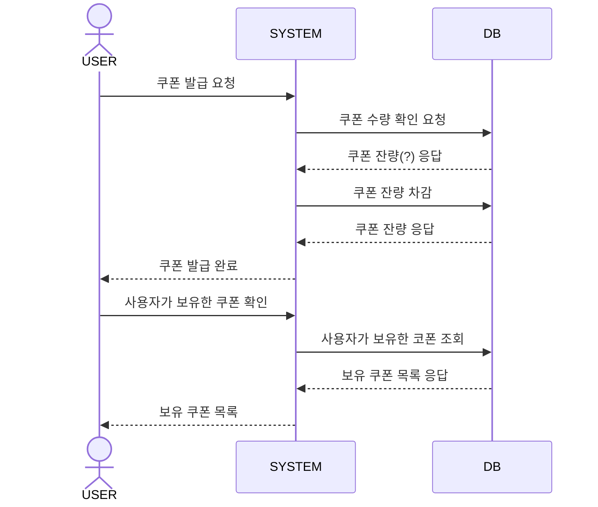
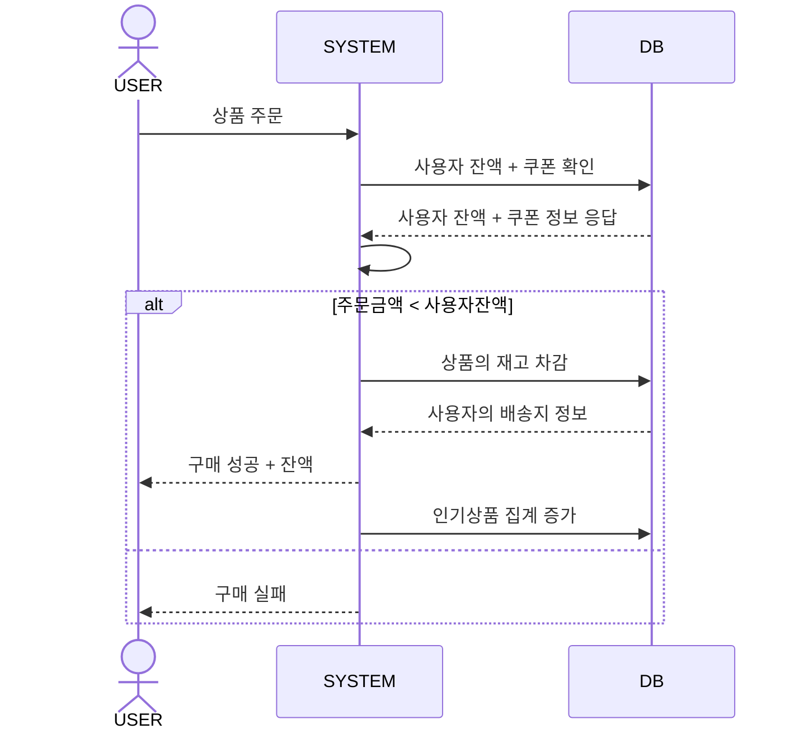
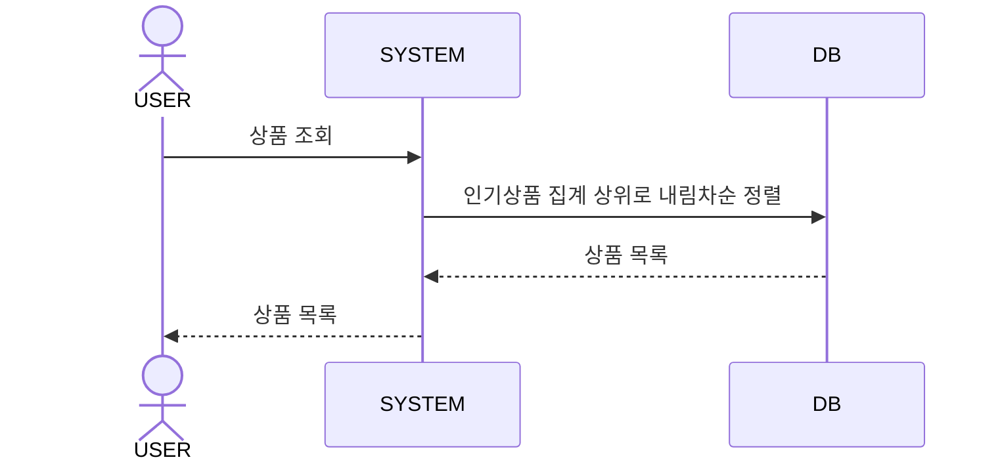

# 시퀀스 다이어그램

## 1️⃣로그인

```mermaid
sequenceDiagram
	actor USER
	participant SYSTEM
	participant DB
    USER ->> SYSTEM: 로그인 요청
    SYSTEM ->> DB : 
    alt 해당 user가 회원인가요? 
        DB -->> SYSTEM: 회원이 아닙니다.
        SYSTEM -->> USER : 로그인 허용
    else 
        DB -->> SYSTEM: 회원 입니다.
        SYSTEM -->> USER : 로그인 허용 안함
    end
```

## 2️⃣주요 잔액 충전 / 조회 API

```mermaid
sequenceDiagram
    actor USER
    participant SYSTEM
    participant DB
    USER ->> SYSTEM: 포인트 충전 요청
    SYSTEM ->> DB : 잔여 포인트 조회
    DB -->> SYSTEM : 잔여 포인트 응답
    SYSTEM ->> SYSTEM : 잔여 포인트 + 충전 포인트
    SYSTEM -->> USER : 최종 포인트
```

### 3️⃣기본 상품 조회 API

```mermaid
sequenceDiagram
    actor USER
    participant SYSTEM
    participant DB
    USER ->> SYSTEM: 상품 조회
    SYSTEM ->> DB : 해당 상품 존재 확인
    DB -->> SYSTEM : 해당 상품 존재 확인 결과 + 재고수량
    SYSTEM -->> USER : 상품 정보 + 재고수량

    USER ->> SYSTEM : 장바구기 추가
    SYSTEM ->> DB : 해당 유저 아이디 전달
    DB ->> DB : 장바구니에 저장
```

### 4️⃣주요 선착순 쿠폰 기능

```mermaid
sequenceDiagram
    actor USER
    participant SYSTEM
    participant DB
    USER ->> SYSTEM : 쿠폰 발급 요청
    SYSTEM ->> DB : 쿠폰 수량 확인 요청
    DB -->> SYSTEM : 쿠폰 잔량(?) 응답
    SYSTEM ->> DB : 쿠폰 잔량 차감
    DB -->> SYSTEM : 쿠폰 잔량 응답
    SYSTEM -->> USER : 쿠폰 발급 완료
    USER ->> SYSTEM : 사용자가 보유한 쿠폰 확인
    SYSTEM ->> DB : 사용자가 보유한 코폰 조회
    DB -->> SYSTEM : 보유 쿠폰 목록 응답
    SYSTEM -->> USER : 보유 쿠폰 목록
```

### 5️⃣주요 주문 / 결제 API

```mermaid
sequenceDiagram
    actor USER
    participant SYSTEM
    participant DB
    USER ->> SYSTEM : 상품 주문
    SYSTEM ->> DB : 사용자 잔액 + 쿠폰 확인
    DB -->> SYSTEM : 사용자 잔액 + 쿠폰 정보 응답

SYSTEM ->> SYSTEM : 
		alt 주문금액 < 사용자잔액
SYSTEM ->> DB : 상품의 재고 차감
DB -->> SYSTEM : 사용자의 배송지 정보
SYSTEM -->> USER : 구매 성공 + 잔액
SYSTEM ->> DB : 인기상품 집계 증가
else
SYSTEM -->> USER : 구매 실패
end
```

### 6️⃣기본 상위 상품 조회 API

```mermaid
sequenceDiagram
    actor USER
    participant SYSTEM
    participant DB
    USER ->> SYSTEM : 상품 조회
    SYSTEM ->> DB : 인기상품 집계 상위로 내림차순 정렬
    DB -->> SYSTEM : 상품 목록
    SYSTEM -->> USER : 상품 목록 
```
